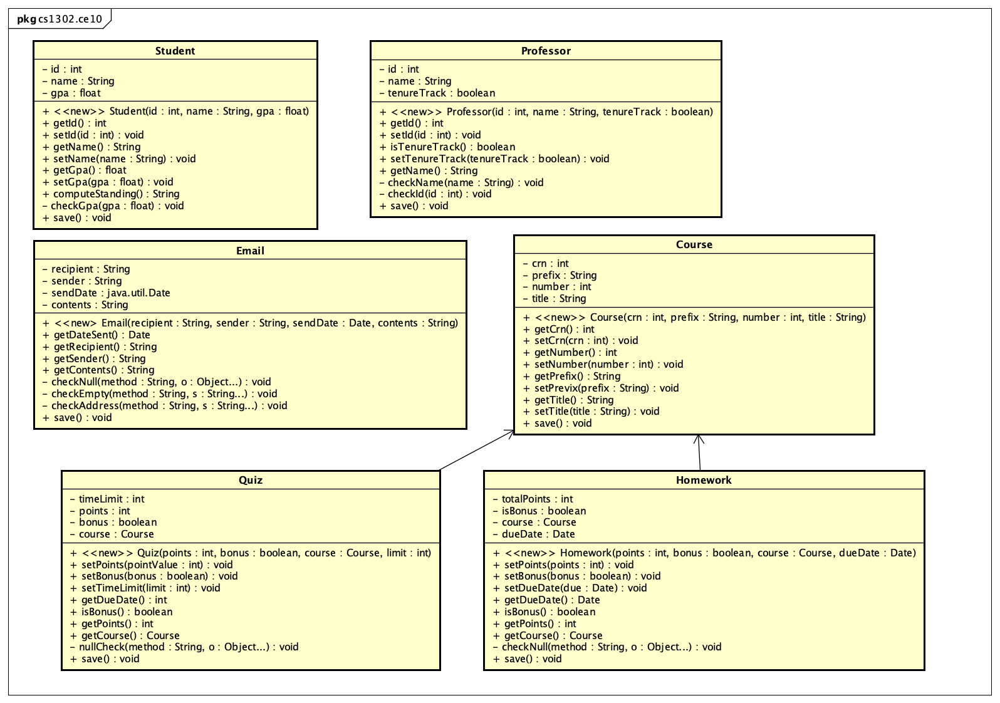

# cs1302-ce10 Hierarchy Refactoring


> By failing to prepare, you are preparing to fail. 
> **--Benjamin Franklin**

This class exercise explores how to incorporate inheritance and interfaces when refactoring code.
It also revists how to commit and view changes to a local Git repository.

## Prerequisite Knowledge

* CSCI 1302 [Inheritance Tutorial](https://github.com/cs1302uga/cs1302-tutorials/blob/master/inheritance/inheritance.md)
* CSCI 1302 [UML Tutorial](https://github.com/cs1302uga/cs1302-tutorials/blob/master/uml/uml.md)

## Course-Specific Learning Outcomes

* **LO2.a:** Identify redundancy in a set of classes and interfaces, then refactor using inheritance and 
polymorphism to emphasize code reuse.
* **LO3.c:** Generate user-facing API documentation for a software solution.
* **LO4.c:** Design, create and use inheritance relationships in a software solution.

## Questions

In your notes, clearly answer the following questions. These instructions assume that you are 
logged into the Nike server. 

**NOTE:** If a step requires you to enter in a command, please provide in your notes the full 
command that you typed to make the related action happen. If context is necessary (e.g., the 
command depends on your present working directory), then please note that context as well.

### Getting Started

1. Use Git to clone the repository for this exercise onto Nike into a subdirectory called `cs1302-ce10`:

   ```
   $ git clone --depth 1 https://github.com/cs1302uga/cs1302-ce10.git
   ```

1. **[ALL GROUP MEMBERS]**
   If you did not setup your Git username and email on Nike when working on `cs1302-ce07`,
   then please revist that exercise and follow the instructions presented there.

1. Change into the `cs1302-ce10` directory that was just created and look around. There should be
   multiple Java files contained within the directory structure. To see a listing of all of the 
   files under the `src` subdirectory, use the `find` command as follows:
   
   ```
   $ find src
   ```

   For each Java file under the `src` subdirectory, fill out a row in a table similar to the one below.
   The "Java Type" column should list the outermost type in the file (e.g., class, interface, enum, etc). 
   The "Depends On" column should list any Java types in the `cs1302.ce10` package that the file
   is dependent upon. You can tell a file has no dependencies by looking through the source code and then
   verifying by compiling without the `-cp` argument. If a file requires `-cp` to compile, it has dependencies
   on other classes in the exercise. To determine the "Line Count", you may use the `wc` command. 
   
   | File Name | Java Type? | FQN | Depends On | Line Count |
   |-----------|------------|-----|------------|------------|
   |-----------|------------|-----|------------|------------|
   |-----------|------------|-----|------------|------------|
   |-----------|------------|-----|------------|------------|

1. There are six classes in the `cs1302.ce10` package. The complete UML diagram can be seen below.
   Take a few minutes to look over the diagram.
   
   **As you look at the diagram, please answer the following questions in your notes:**
   
   * What do the arrows in the UML diagram represent?
   * How many private methods and private instance variables exist across all classes?
     **What do you look for to denote private?**
   * How many protected methods and protected instance variables exist across all classes?
   **What do you look for to denote protected?**
   * Are there any explicit inheritance relationships illustrated in the diagram?
   * Are there any inheritance relations between classes in the diagram and classes not in the diagram?
   
   
   
**CHECKPOINT**
   
1. **[TRICKY]** Code __refactoring__ is the process of restructuring existing computer code without changing 
   its external behavior. As you likely noticed in your UML diagram, there is a lot of redundancy
   among the classes in the starter code. Let's attempt to reduce that redundancy. In your notes, 
   draw a **new** UML diagram that reduces most of that redundancy. Here are some things you can
   do (we recommend considering these things in the order presented below):
   
   * Introduce new (parent) classes for "is-a" relationships;
   * Introduce new interfaces for "can-do" relationships; 
   * Introduce new stand-alone utility classes when neither an "is-a" or "can-do" relationship makes sense; and
   * Push common variables and methods up the hierarchy when reasonable.
   
   **This is a tricky activity!** You should make every effort to utilize abstract methods and overrides 
   effectively. If you have questions about your design, then feel free to ask!
   
1. For each class and interface in your group's UML diagram, provide a justification for why you
   made it that way. Your instructor or PLA will check your UML and point at random boxes, then
   ask you, "why?" When you respond, you should answer verbally and show them your response in your
   notes. 

**CHECKPOINT**

1. For each box in your UML diagram, including new class and interfaces, fill out a table similar to 
   the following:
   
   | File Name | Java Type? | FQN | Depends On |
   |-----------|------------|-----|------------|
   |-----------|------------|-----|------------|
   |-----------|------------|-----|------------|
   |-----------|------------|-----|------------|
   
1. Based on the "Depends On" column in the previous step, list the files in order of
   increasing dependency, starting with those that are independent. 

1. Refactor the code in the `cs1302.ce10` package based on your **approved** UML diagram from the
   previous checkpoint. You should do this one `.java` file at a time, in the order you came
   up with in the previous step. **For each file, you need to do the following:**
   
   1. Edit or create the file based on your UML diagram.
   1. Attempt to compile. If you encounter any compililation errors:
      1. If it's note-worthy, write the error down in your notes;
      1. Fix the error in your code;
      1. Recompile; then
      1. Repeat as needed.
   1. Make sure your code passes `checkstyle`.
   1. Tell Git to track changes made to the file, then commit the changes to your local copy of the 
      repository. Be sure to include a good log message.

1. Regenerate the API documentation website for all of the code in the `cs1302` package.

1. Now, for each `.java` file under the `src` directory, fill out a row in a table similar to 
   the following:

   | File Name | Line Count |
   |-----------|------------|
   |-----------|------------|
   |-----------|------------|
   |-----------|------------|

1. Use Git to view your commit log.

1. Besides reducing the number of lines, what are two advantages of refactoring using inheritance
   and interfaces that your group noticed while working on this exercise?
   
1. Given the choice, would you design with inheritance and interfaces in mind? **Why or why not?**

**CHECKPOINT**

1. On the Internet, a war rages on among the kittens of the proleteriat and plebians alike.
   Who will be victorious? You can help decide at http://www.kittenwar.com! Here are pictures of
   two kittens, DJ Plattypuss Platyhelminth and Mocha, engaging in an epic battle:
   
   [](http://www.kittenwar.com/kittens/82574/)
   [](http://www.kittenwar.com/kittens/102553/)

   **LEGAL NOTICE:** We are not affiliated, associated, authorized, endorsed by, or in any way officially 
   connected with http://www.kittenwar.com. **WARNING:** This site linked to in the next sentence may potentially 
   trigger seizures for people with photosensitive epilepsy. We like [dogs](https://www.omfgdogs.com) too.
   
**NOT A CHECKPOINT**

<hr/>

[](http://creativecommons.org/licenses/by-nc-nd/4.0/)

<small>
Copyright &copy; Michael E. Cotterell, Brad Barnes, and the University of Georgia.
This work is licensed under a <a rel="license" href="http://creativecommons.org/licenses/by-nc-nd/4.0/">Creative Commons Attribution-NonCommercial-NoDerivatives 4.0 International License</a> to students and the public.
The content and opinions expressed on this Web page do not necessarily reflect the views of nor are they endorsed by the University of Georgia or the University System of Georgia.
</small>
