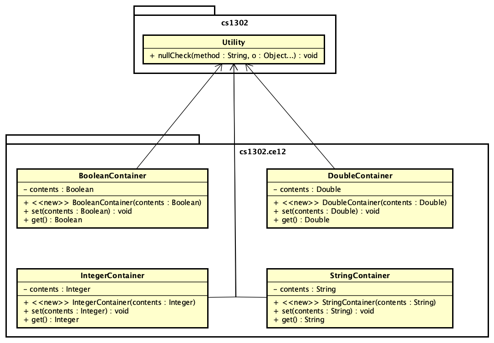

# cs1302-ce12 Subsumption Trade-offs


> One Ring to rule them all, One Ring to find them [...]
> **--J.R.R. Tolkien's epigraph to _The Lord of the Rings_**

This class exercise explores more ways to refactor code to remove redundancy. The particular
way in which you are asked to refactor in this exercise is specifically forced in order to
motivate the alternative approach presented in a later exercise; however, both approaches
have their particular merits and trade-offs. 

## Prerequisite Knowledge

* Reference variables.
* [`Object` API Documentation](https://docs.oracle.com/javase/8/docs/api/java/lang/Object.html)

## Course-Specific Learning Outcomes

* **LO2.a:** Identify redundancy in a set of classes and interfaces, then refactor using inheritance and 
polymorphism to emphasize code reuse.
* **LO4.d:** Utilize  inheritance-based polymorphism in a software solution.

## Questions

In your notes, clearly answer the following questions. These instructions assume that you are 
logged into the Nike server. 

**NOTE:** If a step requires you to enter in a command, please provide in your notes the full 
command that you typed to make the related action happen. If context is necessary (e.g., the 
command depends on your present working directory), then please note that context as well.

### Getting Started

1. Use Git to clone the repository for this exercise onto Nike into a subdirectory called `cs1302-ce12`:

   ```
   $ git clone --depth 1 https://github.com/cs1302uga/cs1302-ce12.git
   ```

1. Change into the `cs1302-ce12` directory that was just created and look around. There are five 
   classes contained in the subfolders (excluding the `Driver` program). Take a few minutes to look 
   over the source code and the UML diagram below.
   
   

1. Use Emacs to open the `Driver.java` file. In your notes, write the expected output for the four
   print statements contained in the code.
   
1. Compile all of the starter code using `bin` as the default package for compiled code.
   Run the `cs1302.ce12.Driver` class. Does the output match what you wrote in the previous step?
   If not, explain why not.
   
1. As you likely saw while exploring the UML diagram above, there is some redundancy among 
   the different container classes. In your notes, **draw a new UML diagram** that reduces the overall 
   redundancy by adding or removing classes and/or interfaces and making use of appropriate inter-class
   associations.
   
   * **Do NOT write any actual code yet!** We want to approve your UML design before you write
     any code as it's generally easier to update a diagram if changes need to be made.
     
   * **NOTE:** Currently, there is no inheritance or interface relationships in the diagram. This
     step _can_ be solved without either. One way to remove reduncy would be to replace a set of
     classes with a single class that does the same thing. 
   
1. How does your redesign reduce redundancy? Justify your answer. 

   **NOTE:** If the instructor or PLA thinks that further redundancy can be eliminated, then 
   they may ask you to repeat these last two steps before signing off your checkpoint. If you're 
   asked to repeat the last two steps, then don't scratch your work! Keep your existing designs
   and notes available so that you can reflect on the evolution of your design choices.

**CHECKPOINT**

1. Make sure you are in the `cs1302-ce12` directory. Delete the code for the container classes 
   using Git and the `rm` command:
   
   ```
   $ git rm -rf src/cs1302/ce12/*Container.java
   ```
   
1. What is the output of the Git `status` command?

1. Commit the changes to your local copy of the repository. 
   Be sure to include a good log message.

1. Write and document the code to implement your approved design from the previous checkpoint.
   Make sure that any types you create are in the `cs1302.ce12` package. 
   
1. Does the output of `git status` show any files as untracked? If so, which ones?

1. Tell Git to track the `.java` files you just created.
   Using `git status`, how can you tell the file is now tracked?

1. Make sure your code passes the `checkstyle` audit.

1. Commit the changes to your local copy of the exercise repository.
   Be sure to include a good log message.
   
**CHECKPOINT**
   
1. Modify the `cs1302.ce12.Driver` class to utilize your redesign.

1. If you encounter any compililation errors:

   1. Write the error down in your notes;
   1. Fix the error in your code;
   1. Recompile; then
   1. Note the fix in your notes.
   1. Repeat as needed.

1. Make sure your code passes the `checkstyle` audit.

1. Commit the changes to your local copy of the exercise repository.
   Be sure to include a good log message.

1. What is the output of running the `cs1302.ce12.Driver` class?
   Did the output match the output of the original driver?
   
1. **[TRICKY]** What is a potential con/negative to your redesign?
   Consider outside perspectives.

**CHECKPOINT**

<hr/>

[](http://creativecommons.org/licenses/by-nc-nd/4.0/)

<small>
Copyright &copy; Michael E. Cotterell, Brad Barnes, and the University of Georgia.
This work is licensed under a <a rel="license" href="http://creativecommons.org/licenses/by-nc-nd/4.0/">Creative Commons Attribution-NonCommercial-NoDerivatives 4.0 International License</a> to students and the public.
The content and opinions expressed on this Web page do not necessarily reflect the views of nor are they endorsed by the University of Georgia or the University System of Georgia.
</small>
