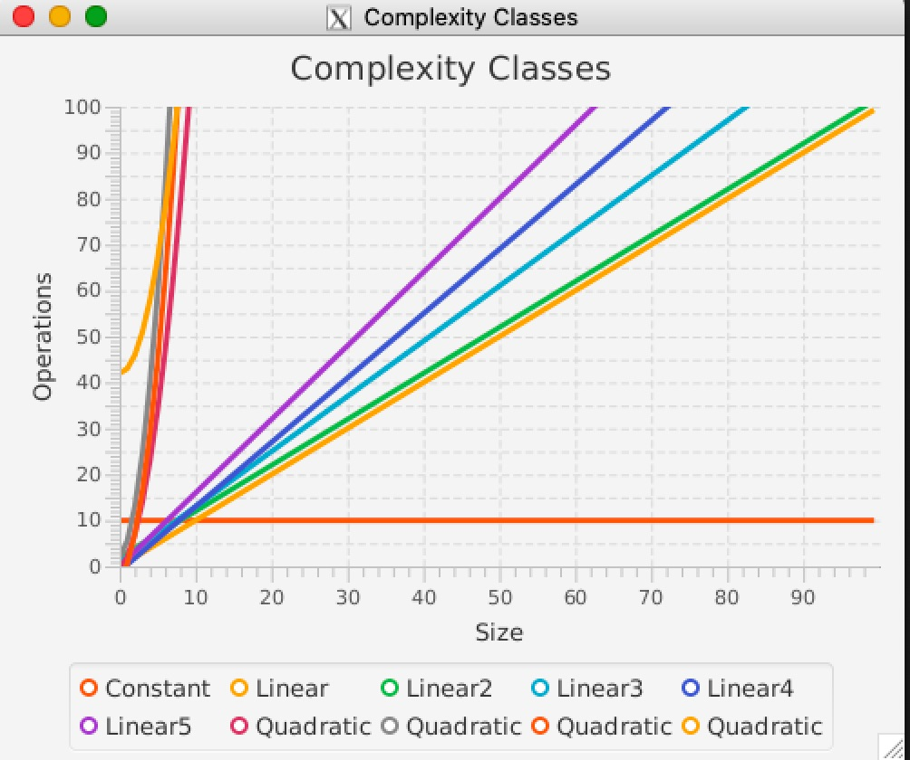

# cs1302-ce29 Complexity Classes


In this class exercise, you will gain a deeper understanding of the notable complexity classes by plotting 
the functions using a JavaFX `LineChart`. By the end of the exercise, your application should show all of
the notable complexity classes in the `LineChart`. The final product should look similar to the image below.


## Course-Specific Learning Outcomes
* **LO3.d:** Apply pair-programming principles in a software-based project.
* **LO5.a:** Utilize a version control tool such as Git or Subversion to store 
and update source code in a multi-programmer software solution.
* **LO6.c:** (Partial) Implement, analyze, and assess combinations of searching/sorting 
algorithms such as linear search, binary search, quadratic sorts, and linearithmic sorts.

## References and Prerequisites

* [`CSCI 1302 Big-O Tutorial`](http://csweb.cs.uga.edu/~mec/cs1302-bigo/)
* Java Generics
* Lambda Expressions
* A basic understanding of JavaFX and the `LineChart` class.

## Questions

In your notes, clearly answer the following questions. These instructions assume that you are 
logged into the Nike server. 

**NOTE:** If a step requires you to enter in a command, please provide in your notes the full 
command that you typed to make the related action happen. If context is necessary (e.g., the 
command depends on your present working directory), then please note that context as well.

### Getting Started
   
1. To get the most out of this exercise, we encourage you to
   **form a group of exactly two people for this exercise.**
   
   * **Working in a group?** Some steps in this exercise need be done by each group member individually.
   If a step is being performed by one group member, then everyone is expected
   to watch, pay attention, and take notes. We recommend that you use Comte de Rochambeau's technique 
   to determine who gets to be group member 1 and group member 2.
   
   * **Working by yourself?** That's okay. If the instructions ask you to switch, then don't switch.

1. **Individually:** Make sure that you have done the following:

   1. [Setup your Free GitHub Pro Account](https://github.com/cs1302uga/cs1302-tutorials/blob/master/github-setup.md#setting-up-an-account)
   
   1. [Setup your SSH Keys on Nike and GitHub](https://github.com/cs1302uga/cs1302-tutorials/blob/master/github-setup.md#setting-up-ssh-keys)

1. **Individually:** If you haven't already done this in a previous exercise, setup your Git username 
   and email on Nike by modifiying and executing the commands below. 
   When setting the `user.name` property, please provide your name as it appears on eLC and
   Athena. If you have a preferred name, then you may include it in parentheses. For the
   `user.email` property, please use your `@uga.edu` email address:

   ```
   $ git config --global user.name "Mona Lisa (Liz)"
   $ git config --global user.email "email@uga.edu"
   ```
   
   You can verify that these properties were setup correctly by observing the output of
   the following commands:
   
   ```
   $ git config --global user.name
   $ git config --global user.email
   ```
   
1. If asked, please be ready to show the public key that you generated on Nike both on
   Nike and on your GitHub account.
   
   * To see the copy of your public key on Nike:
     ```
     $ cat ~/.ssh/id_rsa.pub
     ```
   * To see the copy of your public key on GitHub, please visit: https://github.com/settings/keys
   
1. **GROUP MEMBER 1:** Create a [new repository](https://github.com/new) on GitHub with 
   the following information:
   
   Do **NOT** "Initialize this repository with a README". 
   Also, do **NOT** click on the dropdowns for a `.gitignore` or license file.
   
   | **Field**            | **Value**                                                        |
   |----------------------|------------------------------------------------------------------|
   | **Owner**            | _your account_                                                   |
   | **Repository Name**  | `cs1302-ce29`                                                    |
   | **Description**      | `Repository for Class Exercise 29`                               |
   | **Public / Private** | Private -- You choose who can see and commit to this repository. |
   
   Once complete, you should have a GitHub-hosted private Git repository at the following
   website URL: `https://github.com/your_username/cs1302-ce29` where `your_username` is
   your GitHub account username. 
   
   Do **NOT** follow any of the setup instructions given on GitHub at this time.
   
1. **If not in a group,** skip to the next step; otherwise, perform the sub-steps below.   

   1. **GROUP MEMBER 1:** On the repository's website, add your group members as collaborators
      by going to "Settings" → "Manage Access" → "Invite a Collaborator". This will send them 
      an invite that they can accept either via email or by visiting the repository's website on GitHub.
   
   1. **GROUP MEMBER 2:** Go to the repository website on GitHub and accept the invition
      from Group Member 1. If you see a 404 error instead of an invitation, then double check
      the following:
   
      * Repository Website URL
   
      * Username that Group Member 1 used when they added you
   
      Before continuing, make sure each group member has access to the repository website.  
   
1. **In the remaining instructions,**
   **`TEAM_REPO_SSH` will refer to the SSH URL for that repository as provided by GitHub.**
   The SSH URL is not the same as the URL above. It should look like: 
   `git@github.com:your_username/cs1302-ce29.git` where `your_username` is
   your group member 1's GitHub username. 

1. **Group Member 1:** clone your empty team repository to your Nike account and
   setup a link to the remote skeleton repository provided by your instructor. The
   required sequence of commands is provided below. You should make every effort to 
   understand what each command is doing *before* you execute the command.

   ```
   $ git clone --depth 1 TEAM_REPO_SSH cs1302-ce29
   $ cd cs1302-ce29
   $ git remote add skeleton https://github.com/cs1302uga/cs1302-ce29.git
   $ git pull skeleton master
   $ git push origin master
   ```
   
   This team member should now be good to go. 

1. **Group Member 2:** Should now be able to perform the same sequence of steps,
   omitting the last two steps:

   ```
   $ git clone --depth 1 TEAM_REPO_SSH cs1302-ce29
   $ cd cs1302-ce29
   $ git remote add skeleton https://github.com/cs1302uga/cs1302-ce29.git
   ```
   
1. **Individually:** Take a minute to read the pair programming workflow
   in the [Workflow](#workflow) section, which provides an
   overview of one way to send / receive changes from team member to team member
   while minimizing basic merge conflicts.
   
1. Change into the `cs1302-ce29` directory that you just set up and look around. There should be
   multiple Java files contained within the directory structure. To see a listing of all of the 
   files under the `src` subdirectory, use the `find` command as follows:
   
   ```
   $ find src
   ```
   
1. You should also notice the provided `pom.xml` and `Makefile`. The `Makefile` may be used to compile 
   and run your code. However, the code will not run correctly at this time.
   
1. **Take a minute to think about the result of the last few steps.** 

   * You and your partner now have copies of a repository that was created by the instructors. 
   * You can work on the code in that repository and push the changes to your personal, private, repository on GitHub. 
   * By the end of the exercise, your repository will contain a completed version of the exercise and the
     course repository will still be in the original state. 
   * Also note that since you and your partner are collaborators on your private
     repository, you can both make modifications to the code. 
   * Again, the the [Workflow](#workflow) section contains instructions on how you might navigate this 
     new environment successfully with your partner.
   
## Exercise Steps

### Checkpoint 1 Steps

1. While looking in the `src` directory, you likely saw a file called `ChartUtility.java`. 
   This file contains a utility class with some helpful methods for creating JavaFX line charts.
   Using the provided methods will allow you to focus on plotting the complexity class functions
   instead of the details of how to build a line chart.
   
   Take a few minutes to familiarize yourselves with the documentation for these methods 
   using the documentation found here: 
   [Chart Utility](http://csweb.cs.uga.edu/~mec/cs1302-ce29-doc/)

1. Take a few more minutes to read through `ComplexityClasses.java`. This file contains a `start` method
   which does the following:
   * Creates a JavaFX `LineChart` and adds a data series representing a constant (`O(1)`) function using 
     the `createChart` method of `ChartUtility`.
   * Adds a series representing a linear (`O(n)`) function using the `addSeries` method of `ChartUtility`. 
   * Sets up the scene, and adds the scene to the stage. 
   
1. Pair Program:

   * **Group Member 1:** Open the `ComplexityClasses.java` file
     and implement the `genData` method. Read the associated Javadoc (including the example) along 
     with the example usage of `genData` in the `start` method of `ComplexityClasses` to guide 
     your implementation.
   
   * **Group Member 2:** Stay actively engaged with your group member while
     they are working. Offer suggestions and point out typos or logical errors as they work. 
   
1. **Group Member 1:** Once you complete `genData`, execute the `make` command to compile and 
   run your code. If you 
   notice that the plots are close to the bottom of the graph, you may need to decrease the 
   `Y_FINAL` variable in `ComplexityClasses.java`. Try a few different values to get the plot
   to clearly show the plot lines.

1. **Group Member 1:** Once you are convinced that your code is fully working, check that the
   code passes the `checkstyle` audit, then stage and commit your changes to your local repository with
   tag **`"checkpoint-1"`**, then **push those changes to GitHub**.
   
1. **Group Member 2:** Update your local copy of the repository with the latest
   changes from the repository hosted on GitHub. If successful, everyone should now be 
   able to see the updated exercise files in their local copies! Furthermore    

1. **Everyone:** View the condensed, graphical version of your Git log using `git adog`.

<hr/>


<hr/>

### Checkpoint 2 Steps 

1. **Group Member 2:** Call the `addSeries` method of `ChartUtility` to plot the following 
   **linear** functions for `0 <= n <= 100`.

   * `1.0 * n + 2.0`
   * `1.2 * n + 1.0`
   * `1.4 * n - 1.0`
   * `1.6 * n`
   
   Use `make` to compile and run the code. You should see six total lines in your plot (one constant (at 10.0) and
   five linear). After you've confirmed that everything is working and the plot looks nice, add and commit your 
   changes to the local repository. Don't push to GitHub just yet.
   
1. **Group Member 2:** Create a file called `Notes.md` directly within the `cs1302-ce29` directory. Within that file,
   include the following template:
   
   ```
   # Notes

   Group Member 1: insert member 1 full name here
   Group Member 2: insert member 2 full name here
   
   ## Questions
      i.
     ii.
    iii.
     iv.
      v.
     vi.
    vii.
   viii.
     ix.
      x.
   ```

1. **Group Member 2:** Execute the command `git add Notes.md` to have git track the changes.
   
1. **Group Member 2:** Within `Notes.md`, write answers to the following questions:
      1. If you increase `X_FINAL` to `500` and `Y_FINAL` to `10000`, what do you observe?
         * Specifically, do you notice any drastic changes between the individual
           linear functions that are plotted so far? Please provide more than just a
           yes/no answer. 
      2. If you increase `Y_FINAL` to `20000`, what do you observe? **Note:** if you get a warning message, it is 
         because Java can't squeeze 20000 tick marks into the space given for the y-axis. Ignore the warning for now.
         We will change the code back in the next step.
         * Specifically, do you notice any drastic changes between the individual
           linear functions that are plotted so far? Please provide more than just a
           yes/no answer.

1. Change `X_FINAL` and `Y_FINAL` back to `100`.

1. **Group Member 2:** Once you are convinced that your code is fully working, check that the
   code passes the `checkstyle` audit, then stage and commit your changes to your local repository with
   tag **`"checkpoint-2"`**, then **push those changes to GitHub**.
   
1. **Group Member 1:** Update your local copy of the repository with the latest
   changes from the repository hosted on GitHub. If successful, everyone should now be 
   able to see the updated exercise files in their local copies! Furthermore    

1. **Everyone:** View the condensed, graphical version of your Git log using `git adog`. 
   Also, look at the GitHub page for your repository.

<hr/>


<hr/> 

### Checkpoint 3 Steps

1. **Group Member 1:** Call the `addSeries` method of `ChartUtility` to plot the following 
   **quadratic** functions for `0 <= n <= 100` in addition to any previous functions plotted.

   * `Math.pow(n, 2.0) + 2.0 * n - 1.0`
   * `2.0 * Math.pow(n, 2.0) + 1.5 * n + 2.0`
   * `1.5 * Math.pow(n, 2.0) + 2.0 * n - 3.0`
   * `Math.pow(n, 2.0) + 42.0`
   
   Use `make` to compile and run the code. After you've confirmed that it compiles and runs (and shows
   a nice looking plot), add and commit your changes to the local repository.

1. **Everyone:** With `Y_FINAL` set to 100, take a close look at the plot. It should look very similar to the
   image below. Notice how the quadratic functions are grouped together in the upper left and the linear functions
   are spaced out slightly more near the center of the plot.
   
   
   
1. **Group Member 1:** Increase the value for `Y_FINAL` and then run `make` to show the plots. Do this multiple times
   increasing `Y_FINAL` by a few thousand but no more than twenty thousand each time until `Y_FINAL` reaches a point above
   `100,000`. Then, answer the following **questions to in `Notes.md`:** 
   
   3. As `Y_FINAL` increases, do the quadratic functions appear to space out more or get closer together? Explain.
   4. As `Y_FINAL` increases, do the linear functions appear to space out more or get closer together? Explain.
   
   **NOTE:** <a name="note">As we continue to add worse/bigger functions</a>, pay close attention to groups of functions
   that you previously described as, "getting closer together." Even though the functions in that group/class might 
   have looked different to begin with (because they're different functions), it might be the case that they start 
   to look the same as worse/bigger functions are added. **Remember, these functions represent the running times for algorithms**,
   so we're really observing **how much worse** a higher time complexity algorithm is compared to algorithms in
   the classes below it. 

1. **Everyone:** Note that we are comparing the growth rates of these functions using very small problem sizes (`X_FINAL` is 100). 
   With computer algorithms, it is not uncommon to have a problem size in the millions (or larger). While the number
   of operations required for large problem sizes would increase significantly under such circumstances, we can still gain
   an understanding of the growth of these functions by looking at the smaller problem sizes.
   Changing the value of `Y_FINAL` is increasing the visible range of the y-axis. While
   we are not seeing the impact of these functions at large values of x, we are able to visualize the impact that
   a function has on smaller problem sizes. In other words, we're able to see the increase in the number of operations
   required for a quadratic algorithm when compared to the linear algorithms. 
   **This is why it's always important to try and use an efficient algorithm to solve a problem.**
   
1. **Group Member 1:** Change `Y_FINAL` back to `100`.

1. **Group Member 1:** Once you are convinced that your code is fully working, check that the
   code passes the `checkstyle` audit, then stage and commit your changes to your local repository with
   tag **`"checkpoint-3"`**, then **push those changes to GitHub**.
   
1. **Group Member 2:** Update your local copy of the repository with the latest
   changes from the repository hosted on GitHub. If successful, everyone should now be 
   able to see the updated exercise files in their local copies! Furthermore    

1. **Everyone:** View the condensed, graphical version of your Git log using `git adog`.
   Also, look at the GitHub page for your repository.

<hr/>


<hr/> 

### Checkpoint 4 Steps

1. **Group Member 2:** Call the `addSeries` method of `ChartUtility` to plot the following 
   **cubic** functions for `0 <= n <= 100` in addition to any previous functions plotted.

   * `1.1 * Math.pow(n, 3.0) + 1.3 * n - 4.0`
   * `2.2 * Math.pow(n, 3.0) + 1.5 * n + 2.0`
   * `1.5 * Math.pow(n, 3.0) + n - 3.5`
   * `Math.pow(n, 3.0) - 42.0`
   
   Use `make` to compile and run the code. After you've confirmed that it compiles and runs (and shows
   a nice looking plot), add and commit your changes to the local repository.
   
1. **Group Member 2:** Increase the value for `Y_FINAL` and then run `make` to show the plots. Do this multiple times
   increasing `Y_FINAL` each time. **Note:** You will need to increase `Y_FINAL` quicker than in the previous checkpoint. We
   recommend increasing `Y_FINAL` by between `100,000` and `200,000` each time. 
   
   Then, answer the following **questions to in `Notes.md`:** 
   
   5. How would you describe the quadratics now that you see
      them in the the presence of cubics? Please reread <a href="#note">the note</a> from earlier
      to put this into perspective. 
   6. How would you describe the linears now that you see
      them in the the presence of cubics? Please reread <a href="#note">the note</a> from earlier
      to put this into perspective. 
   
1. **Group Member 2:** Change `Y_FINAL` back to `10,000`.

1. **Group Member 2:** Call the `addSeries` method of `ChartUtility` to plot the following 
   **exponential** functions for `0 <= n <= 100` in addition to any previous functions plotted.

   * `Math.pow(2.0, n) + Math.pow(n, 2.0)`
   * `Math.pow(1.5, n) + 32.0`
   * `Math.pow(1.3, n) + n`
   * `2.0 * Math.pow(1.2, n) - 0.5 * Math.pow(n, 3.0)`
   
   Use `make` to compile and run the code. After you've confirmed that it compiles and runs (and shows
   a nice looking plot), add and commit your changes to the local repository.   
      
1. **Group Member 2:** Increase the value for `Y_FINAL` and then run `make` to show the plots. Do this multiple times
   increasing `Y_FINAL` slowly (by a few hundred each time). We recommend increasing `Y_FINAL` by between `100,000` 
   and `200,000` each time. 
   
   Then, answer the following **questions to in `Notes.md`:** 
   
   7. How would you describe the cubics now that you see
      them in the the presence of exponentials? Please reread <a href="#note">the note</a> from earlier
      to put this into perspective.
   8. How would you describe the quadratics now that you see
      them in the the presence of exponentials? Please reread <a href="#note">the note</a> from earlier
      to put this into perspective.
   9. How would you describe the linears now that you see
      them in the the presence of exponentials? Please reread <a href="#note">the note</a> from earlier
      to put this into perspective.
   
1. **QUESTION to answer in `Notes.md`:** 
   x. What do you think the instructors are tying to get you to see with all these plots?

1. **Group Member 2:** Once you are convinced that your code is fully working, check that the
   code passes the `checkstyle` audit, then stage and commit your changes to your local repository with
   tag **`"checkpoint-4"`**, then **push those changes to GitHub**.
   
1. **Group Member 1:** Update your local copy of the repository with the latest
   changes from the repository hosted on GitHub. If successful, everyone should now be 
   able to see the updated exercise files in their local copies! Furthermore    

1. **Everyone:** View the condensed, graphical version of your Git log using `git adog`.

<hr/>


<hr/>

### Submission Steps

**Each student needs to individually submit their own work.**

1. Create a plain text file called `SUBMISSION.md` directly inside this exercise
   directory with the following information:

   1. Your name and UGA ID number;
   1. Collaborator names, if any; and
   1. The weekly code (listed with the exercise on eLC).
   
   Here is an example:
   
   ```
   1. Sally Smith (811-000-999)
   2. Collaborators: Joe Allen, Stacie Mack
   3. Weekly Code: replace-with-actual-code
   ```

1. Add and commit `SUBMISSION.md`. Also, do a final check to ensure your code 
   passes the `checkstyle` audit, then stage and commit all changes.

1. Change into the parent directory and use the `submit` command to submit this exercise to `cs1302a`:
   
   ```
   $ submit cs1302-ce29 cs1302a
   ```
     
<hr/>


<hr/>

## Workflow

If you've followed the instructions included earlier in the exercise,
then you and your partner already have a GitHub-hosted private Git repository
as well as local working copies of that repository on your respective Nike
accounts. The challenge now is how to effectively collaborate using these
three distributed copies of the repository. That is where the workflow
below comes into play. In this context, a workflow describes a sequence of
steps that you and your partner can take to effectively collaborate on the
project and avoid simple merge conflicts.

Below are the steps in our suggested workflow:

1. Decide whose turn it is to **drive**. That person should login to
   their Nike account and change into the local working copy of their
   project's repository. The rest of these steps assume this person
   is executing the commands. When it comes time to change who is
   driving, that person should follow these steps from the beginning.

1. Use `git status` to see the state of the current branch.

   1. Regardless of what branch you are on, stage and commit all tracked files.
      If you manually added any new files, then you should add them and
      commit them.

      ```
      $ git status
      ```

   1. If the branch that you are currently on is not `master`, then
      checkout `master` and repeat the previous sub-step to make
      sure everything is committed in `master`.

      ```
      $ git checkout master
      ```

      If you want / need to, merge the changes from the other branch
      into `master`, then delete the other branch.

      ```
      $ git merge branch_name
      $ git branch -d branch_name
      ```

      **MERGE CONFLICT?** If you merge, then you may encounter a merge conflict.
      In this scenario, Git's output will tell you what files are affected. You
      must then edit those files using your text editor of choice to
      manually resolve the conflict. Git will mark lines in the affected files
      with a special `diff` syntax so that you can easily identify them, then make
      edits to either pick one version or combine them in a desired way.
      The source code should be clean and free of special `diff` syntax
      before you save. Once an affected file is saved, you should
      stage and commit it. The merge conflict is not technically resolved
      until all affected files are fixed, staged, and committed -- these
      can be individual commits or one single commit with all affected files
      on the stage.

1. Now that your local working copy is cleaned up, you should pull
   changes from your team repository into your local working copy.

   ```
   $ git pull origin master
   ```

   If you encounter a merge conflict, then see the **"MERGE CONFLICT?"**
   note provided earlier in this workflow.

1. Instead of working on your exercise directly in the `master` branch,
   create a branch for this programming session based on the most
   recent commit:

   ```
   $ git branch driver
   $ git checkout driver
   ```

   Alternatively, you can use:

   ```
   $ git checkout -b driver
   ```

1. Work on the project. As often as is reasonable, you should stage and
   commit tracked files in this branch. If you add new source code files
   or visual assets (e.g., images in `src/main/resources`), then be
   sure to add and commit them. Liberal use of `git status` is highly
   recommended.

1. Once you are done with this programming session, perhaps for the day
   or because you want to switch who is driving, you should do the
   following:

   1. Stage and commit tracked files. Also ensure that new files that
      you added recently are staged and committed. Remember, you can use
      `git status` to see what's going on.

   1. Checkout the `master` branch, merge `driver` into `master`, resolve
      conflicts if necessary, then delete the `driver` branch.

      ```
      $ git checkout master
      $ git merge driver
      $ git branch -f driver
      ```

      If you encounter a merge conflict, then see the **"MERGE CONFLICT?"**
      note provided earlier in this workflow.


   1. Finally, push your changes up to your team's GitHub repository.

      ```
      $ git push origin master
      ```
      If your partner worked on the project while you were also working
      on the project, then it's possible that you don't have the most
      recent changes. In this scenario, return to the first step and
      quickly repeat -- much of the work is usually minimal in this
      scenario, assuming you both espouse the same workflow.

<hr/>

[](http://creativecommons.org/licenses/by-nc-nd/4.0/)

<small>
Copyright &copy; Michael E. Cotterell, Brad Barnes, and the University of Georgia.
This work is licensed under a <a rel="license" href="http://creativecommons.org/licenses/by-nc-nd/4.0/">Creative Commons Attribution-NonCommercial-NoDerivatives 4.0 International License</a> to students and the public.
The content and opinions expressed on this Web page do not necessarily reflect the views of nor are they endorsed by the University of Georgia or the University System of Georgia.
</small>
