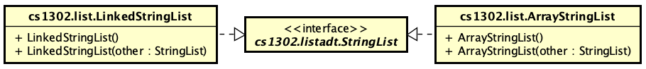

# CSCI 1302 - List ADT v2020.sp


**FRI 2020-02-21 (Feb 21) @ 11:55 PM EST**

This document contains the description for the List ADT project
assigned to the students in the Spring 2020 CSCI 1302 classes
at the University of Georgia.

**Read the entirety of this file before beginning your project.**

**Seriously. Read this entire file *before* starting.**

## Table of Contents

* [Course-Specific Learning Outcomes](#course-specific-learning-outcomes)
* [Academic Honesty](#academic-honesty)
* [Updates](#updates)
* [Project Description](#project-description)
* [Project Requirements & Grading](#project-requirements--grading)
  * [Functional Requirements](#functional-requirements)
  * [Non-Functional Requirements](#non-functional-requirements)
  * [Absolute Requirements](#absolute-requirements)
* [How to Download the Project](#how-to-download-the-project)
* [Submission Instructions](#submission-instructions)
* [Appendix - Suggested Checklist](#appendix---suggested-checklist)
* [Appendix - FAQ](#appendix---faq)

## Course-Specific Learning Outcomes

* **LO1.c:** Create and modify text files and source code using a powerful terminal-based text editor such as Emacs or Vi.
* **LO1.d:** Use shell commands to compile new and existing software solutions that are organized into multi-level 
  packages and have external dependencies.
* **LO2.a:** (Optional) Identify redundancy in a set of classes and interfaces, then refactor using inheritance and polymorphism 
  to emphasize code reuse.
* **LO2.b:** Define, throw, and propagate exceptions appropriately in a software solution.
* **LO2.d:** (Partial) Implement new generic methods, interfaces, and classes in a software solution.
* **LO3.a:** Create and update source code that adheres to established style guidelines.
* **LO3.b:** Create class, interface, method, and inline documentation that satisfies a set of requirements.
* **LO4.a:** Design, create and use interfaces in a software solution.
* **LO4.b:** Utilize interface-based polymorphism in a software solution.
* **LO4.c:** (Optional) Design, create and use inheritance relationships in a software solution.
* **LO7.c:** (Partial) Use common abstract data types and structures, including lists, queues, arrays, and stacks in solving 
  typical problems.
  
## Academic Honesty

**You agree to the Academic Honesty policy as outlined in the course syllabus.**
In accordance with this notice, I must caution you **not** to 
fork this repository on GitHub if you have an account. Doing so will more than
likely make your copy of the project publicly visible. Please follow the 
instructions contained in the 
[How to Download the Project](#how-to-download-the-project)
section below in order to do your development on nike. Furthermore, you must adhere
to the copyright notice and licensing information at the bottom of this document.

## Updates

If there has been an update and you have already cloned the project to Nike, 
then you can update your copy of the project using the <code>$ git pull</code>
command while inside of your project directory.

## Project Description

In this project, you will be providing two different implementations of
a `StringList` interface, which defines different operations that one
should be able to do with a *list of strings*. A list is simply an object that represents 
an ordered collection of elements. The list implementation can decide how the
elements are stored internally so long as users are able to interact with
those elements via the methods defined in the interface. In this way, a list
is an example of an *abstract data type* (ADT). To put it another way: while 
the implementor needs to understand the specific details of the implementation
(in order to write the code to make it happen), the user of a list does not. 
The users simply interact with objects of the list implementation through
the methods defined in the interface. 

**In order to truly understand this project,**  you must take a step back and think about how 
a list object and its storage are separate things. A list uses its storage to actually store 
its elements. For example, the size of a list does not have to be the same as the size of its 
storage, although the storage is likely at least as big as the list. For example, say you have
created a shopping list with 5 items on it. You would say that there are five items on your list.
If the list is implemented as a class in Java, you might have some internal storage (say, an array) 
that can hold more than five items. From the outside perspective, the list still contains 5 
elements even though the internal storage may be larger. The internal array is hidden and is of no
concern to the user of the class.

Each implementation of the `StringList` interface will be a concrete class with specific functional
and non-functional requirements. These classes need to implement `StringList`
either directly or via a common abstract parent class.

For this project, you will *NOT* have access to the `.java` files for the
interface. Instead, you will have access to the generated API documentation
for the interface <a href="http://cobweb.cs.uga.edu/~mec/cs1302/listadt-api/">here</a>.
Implementors should make sure that each method functions or behaves as described
by the interface's API documentation, except in cases where a functional requirement 
changes the behavior of the method.

Implementors are always free to implement additional methods in addition
to the ones defined by the interface. However, they should not assume that
users (e.g., graders) will use them (even if declared with `public` visibility), 
since they are not defined in the interface. These additional methods may help
avoid redundancy and promote code reuse within an implementation.

**We understand that this project may seem overwhelming and that you might not know
where to get started.** Because of this, based on discussions with past students,
we have prepared a [Suggested Checklist](#appendix---suggested-checklist) section in
the Appendices which contains some suggestions on how to work through the project 
from start to finish.

### Suggested Reading

* [Interfaces Tutorial](https://github.com/cs1302uga/cs1302-tutorials/blob/master/interfaces/interfaces.md)
* [API Documentation for `StringList`](http://csweb.cs.uga.edu/~mec/cs1302/listadt-api/)

## Project Requirements & Grading

This assignment is worth 100 points. The lowest possible grade is 0, and the 
highest possible grade is 110 (due to extra credit).

### Functional Requirements

A functional requirement is *added* to your point total if satisfied.
There will be no partial credit for any of the requirements that simply 
require the presence of a method related to a particular functionality. 
The actual functionality is tested using test cases.

For this project, you are required to create two different classes that
implement the same interface. While the specific details are listed below,
the following diagram illustrates the general relationship between your 
classes and the interface (with instance variables and most methods omitted 
from the diagram for brevity):



The specific requirements for each class are presented below.

* **`ArrayStringList`:** Create the `cs1302.list.ArrayStringList` class such
  that it properly implements the `cs1302.listadt.StringList` interface with additional
  requirements listed below.

  * You must explicitly define and document  default constructor for this class. 
    The initial size of an `ArrayStringList` is `0` regardless of the list's
    underlying storage--remember, the list's internal storage and the list 
    itself are two different things. Here is the signature:
	
    ```java
    public ArrayStringList();
    ```

  * You must explicitly define and document a copy constructor for this class.
    It should make the new list a deep copy of the other list. Therefore, the initial 
    size and element values of the new list should be the other list. The other
    list can be any implementation of the `StringList` interface. Here is
    the signature:
	
    ```java
    public ArrayStringList(StringList other);
    ```
    
  * Over the lifetime of an `ArrayStringList` object, its internal storage may
    change in order to accomodate more list elements. When your code increases
    the size of an `ArrayStringList` object's internal array storage, 
    **you should actively avoid: i) increasing the array size by one; and ii)
    doubling the size of the array.** Somewhere inbetween is more reasonable.
    Furthermore, **you should not set the initial array size to `0` or to the
    largest number that is allowed.** 
	
  * There is a requirement related to this class's storage included
    in the [Absolute Requirements](#absolute-requirements) section.

  * **Extra Credit (5 points):** Override the `iterator()` method for your
    `ArrayStringList` class as described in the `StringList` interface. This _may_ 
    require you to create an additional class that implements another interface.
    Some web searching might recommend an anonymous inner class. Please do not do this.
    If you choose to do this extra credit, then you should create a regular class
    that properly implements the desired interface. 
    In addition to properly overriding `iterator()`, to receive points for this 
    extra credit, you must include a file called `EXTRA.md` in your immediate project 
    directory and place the text `[EC2]` on a single line within the file. In this
    file, you should have one line for each extra credit that you want the the grader
    to check. 

    **NOTE:** You do not need to implement the `iterator()` method if you
    are not doing the extra credit.

* **`LinkedStringList`:** Create the `cs1302.list.LinkedStringList` class such
  that it properly implements the `cs1302.listadt.StringList` interface 
  with additional requirements listed below. 

  * You must explicitly define and document  default constructor for this class. 
    The initial size of a `LinkedStringList` is `0` regardless of the list's
    underlying storage--remember, the list's internal storage and the list 
    itself are two different things. Here is the signature:
	
    ```java
    public LinkedStringList();
    ```

  * You must explicitly define and document a copy constructor for this class.
    It should make the new list a deep copy of the other list. Therefore, the initial 
    size and element values of the new list should be the other list. The other
    list can be any implementation of the `StringList` interface. Here is
    the signature:
	
    ```java
    public LinkedStringList(StringList other);
    ```
	
  * There is a requirement related to this class's storage included
    in the [Absolute Requirements](#absolute-requirements) section.

  * **Extra Credit (5 points):** Override the `iterator()` method for your
    `LinkedStringList` class as described in the `StringList` interface. This _may_ 
    require you to create an additional class that implements another interface.
    Some web searching might recommend an anonymous inner class. Please do not do this.
    If you choose to do this extra credit, then you should create a regular class
    that properly implements the desired interface. 
    In addition to properly overriding `iterator()`, to receive points for this 
    extra credit, you must include a file called `EXTRA.md` in your immediate project 
    directory and place the text `[EC2]` on a single line within the file. In this
    file, you should have one line for each extra credit that you want the the grader
    to check. 

    **NOTE:** You do not need to implement the `iterator()` method if you
    are not doing the extra credit.

* **(100 points) Test Cases**: The bulk of this project will be graded
  based on 50 JUnit test cases, each worth 2 points. This is the same as
  someone using the classes you wrote based purely on the interface
  definitions. If you implement the interface correctly, then you should
  pass the associated test cases. 
  
### Non-Functional Requirements

A non-functional requirement is *subtracted* from your point total if
not satisfied. In order to emphasize the importance of these requirements,
non-compliance results in the full point amount being subtracted from your
point total. That is, they are all or nothing. 

* **(0 points) [RECOMMENDED] No Static Variables:** Use of static variables
  is not appropriate for this assignment. However, static constants are 
  perfectly fine.
  
* **(20 points) Code Style Guidelines:** You should be consistent with the style 
  aspect of your code in order to promote readability. Every `.java` file that
  you include as part of your submission for this project must be in valid style 
  as defined in the [CS1302 Code Style Guide](https://github.com/cs1302uga/cs1302-styleguide).
  All of the individual code style guidelines listed in that document are part 
  of this single non-functional requirement. Like the other non-functional
  requirements, this requirement is all or nothing. 
  
  **NOTE:** The [CS1302 Code Style Guide](https://github.com/cs1302uga/cs1302-styleguide)
  includes instructions on how to use the `checkstyle` program to check
  your code for compliance on Nike.  

* **In-line Documentation (10 points):** Code blocks should be adequately documented
  using in-line comments. This is especially necessary when a block of code
  is not immediately understood by a reader (e.g., yourself or the grader).

### Absolute Requirements

An absolute requirement is similar to a non-functional requirement, except that violating
it will result in an immediate zero for the assignment. In many cases, a violation
will prevent the graders from evaluating your functional requirements. No attempts will be
made to modify your submission to evaluate other requirements.

* **Project Directory Structure:** The location of the default
  package for the source code should be a direct subdirectory of 
  `cs1302-listadt` called `src`. When the project is compiled, 
  the `-d` option should be used with `javac` to make the default package 
  for compiled code a direct subdirectory of `cs1302-listadt` 
  called `bin`. 
  
  If you follow this structure, then you would type the following to compile 
  your code, assuming you are in the top-level project 
  directory `cs1302-listadt`:
  
  ```
  $ javac -cp listadt.jar -d bin src/cs1302/list/ArrayStringList.java
  $ javac -cp listadt.jar -d bin src/cs1302/list/LinkedStringList.java
  ```
  
  Remember, when you compile `.java` files individually, there might be 
  dependencies between the files. In such cases, the order in which you
  compile the code matters. Also, if more than one default package is needed
  (e.g., `listadt.jar` and some other directory like `bin`), then a colon `:` 
  can be used to separate each path in a list of multiple paths supplied
  to `-cp` (e.g., `-cp listadt.jar:bin`). For more information, see 
  ["Setting the Classpath"](https://github.com/cs1302uga/cs1302-tutorials/blob/master/packages.md#setting-the-class-path) 
  in the package tutorial.

* __Development Environment:__ This project must be implemented 
  in Java 8, and it *must compile and run* correctly on Nike using the specific
  version of Java 8 that is setup according to the instructions provided
  by your instructor. 
  
  If you decide to introduce additional `.java` files into your project,
  then they are expected to fulfill all non-functional and absolute requirements, 
  even if the main parts of the project do not use them. You may assume
  graders will compile your source code in an order that satisfies
  compilation dependencies. You should remove any `.java` files that you
  do not need before submission. 
  
* **`cs1302.list.ArrayStringList` Storage Requirement:**
  You must use a basic Java array for this class's storage. The initial
  size of the array does not have to be the same size as the initial size
  of the list. Whenever the size of the list is about to exceed the size
  of its array, the list should dynamically allocate a new array of a larger
  size and copy the contents over--please consider writing and documenting
  a private support method to do this. If you use Java's `java.util.ArrayList` 
  class or something similar, then that will result in an immediate violation
  of this non-functional requirement, regardless of any use of a regular
  array elsewhere in the class. This requirement also prohibits any use of 
  third-party implementations of list or list-like interfaces.

* **`cs1302.list.LinkedStringList` Storage Requirement:**
  You must use a sequence of `cs1302.listadt.StringList.Node` objects
  for this class's storage. Unlike the array-based implementation in
  `ArrayStringList`, this type of storage is not limited to the number
  of elements that can fit into an array (because there is not an array).
  Instead, it's limited only by the available memory for the Java program
  using the `LinkedStringList` object. 
  If you use Java's `java.util.LinkedList` class or something similar, then that 
  will result in an immediate violation of this non-functional requirement, 
  regardless of any use of any `Node` objects elsewhere in the class.
  This requirement also prohibits any use of third-party implementations 
  of list or list-like interfaces.
 
* **No Implementation Dependencies:** You are not permitted to use one 
  implementation of the `StringList` interface in another implementation.
  For example, you cannot use the `ArrayStringList` class inside of your
  `LinkedStringList` class or vise versa. If you decide to implement a
  parent class or create a class for the extra credit, then those new classes
  cannot depend on either of the `StringList` implementations, however,
  they can depend on the `StringList` interface itself. If you have any
  questions about this, then please ask your instructor.

### Grading

This project will be graded using unit tests, none of which will be made 
available before the project deadline. You can test your implementations yourself
via interface polymorphism.

## How to Download the Project

On Nike, execute the following terminal command in order to download the project
files into sub-directory within your present working directory:

```
$ git clone --depth 1 https://github.com/cs1302uga/cs1302-listadt.git
```

This should create a directory called `cs1302-listadt` in
your present working directory that contains a clone of the 
project's respository. Take a look around.

If any updates to the project files are announced by your instructor, you can
merge those changes into your copy by changing into your project's directory
on Nike and issuing the following terminal command:

```
$ git pull
```

If you have any problems with these download procedures, then please contact
your instructor.

## Submission Instructions

You will be submitting your project via Nike before the deadline indicated
near the top of this document. Make sure your project files
are on `nike.cs.uga.edu`. Change into the parent directory of your
project directory. If you've followed the instructions provided in this document, 
then the name of your project directory is likely `cs1302-listadt`. 
While in your project's parent directory, execute the following command: 

```
$ submit cs1302-listadt cs1302a
```

It is also a good idea to email a copy to yourself. To do this, simply execute 
the following command, replacing the email address with your email address:

```
$ tar zcvf cs1302-listadt.tar.gz cs1302-listadt
$ mutt -s "[cs1302] cs1302-listadt" -a cs1302-listadt.tar.gz -- your@email.com < /dev/null
```

If you have any problems submitting your project then please send a private
post to your instructor via the course Piazza as soon as possible. However, 
creating a post about something like this the day or night the project is due 
is probably not the best idea.

# Appendix - Suggested Checklist

To help you with planning out this project, here are some suggested steps you
can take that your instructors believe will help you complete the project more 
easily. Some of the items in this checklist may not make sense until you have 
read the entire project description, including the [FAQ](#appendix---faq). 
These steps are suggesions and, therefore, do not constitute an exhaustive list 
of steps that you may need to take to complete the project. 

1. Preparation (Estimated Time = 10%):

   - [ ] Read through the entire project description, including the appendices, 
         **and write down questions as you go**.
   - [ ] Read through the entire [API Documentation for `StringList`](http://cobweb.cs.uga.edu/~mec/cs1302/listadt-api/),
         **and write down questions as you go**. 
	 * Be sure to read both the summary comment for each method and its detailed
	   description (which can be reached by clicking on it). 
   - [ ] Read both of them again! This time, you may be able to answer some of your own questions.
   
1. Before you write any code (Estimated Time = 40%):

   - [ ] For each method in the interface, make sure you understand what a user
         expects to happen when calling that method on an object of an 
	 implementing class. 
   - [ ] For each method in the interface, try to write down what you
         think the basic steps need to be in order to produce the desired outcome.
	 * Try to keep it high level. If the steps that write down sound like they
	   can be accomplished with another method, then replace those steps with
	   a note to refer to that method. If that other method does not yet exist,
	   then you might introduce that as a _private_ or _proctected_ helper method.
	 * Here is an example: If there are multiple methods that have a step that 
	   gets an element from a specific index in the list, then you might have
	   that method call the list's [`get`](https://cobweb.cs.uga.edu/~mec/cs1302/listadt-api/cs1302/listadt/StringList.html#get-int-)
	   method.   
   - [ ] Based on the previous suggestion, draw out what the method dependencies
         are for each method (i.e., what method depends on what). If you notice 
	 any circular dependencies, then those should be eliminated. 
	 * The methods that don't depend on other methods are good candidates to
	   start with in the next phase of your development. We'll call these the
	   independent methods.
	 
1. Prepare to implement the methods:

   - [ ] Create the `.java` files for each implementing class and make sure they
         are in the correct package. For each file:
	 * Write the class signature and all of the method signatures.
	 * In the body of each method, write the `throw` statement that is suggested
	   in [the FAQ](#faq-uoe). Do not attempt to actually implement the method yet.
	 * Run `checkstyle` to make sure that you're off to a good start, style-wise.
	   **Yes, this includes Javadoc comments;** read [this](https://github.com/cs1302uga/cs1302-styleguide/blob/master/README.md#missingjavadocmethod)
	   for a recommended way to handle the inherited documentation. 
	 * Make sure the files compile, even though they're not really implemented yet.
	   This will make it easier to test/debug your code.

1. Actually implement one of the classes (e.g., `ArrayStringList`):

   - [ ] Write the code for the default constructor. You will likely need to introduce 
         instance variables into the class to keep track of object state.
   - [ ] For each of the independent methods you identified earlier, attempt to
         write them. You may need to introduce more instance variables, as needed, into 
	 the class to keep track of object state.
	 * No only should you implement these methods, but **you should test them too**.
	   Create a driver program that creates a list object, calls these methods, 
	   and make sure that they work. When you create a test method, have the method
	   perform it's test on a `StringList` instead of an `ArrayStringList`. That
	   way, you'll know that it works from the perspective of the interface.
	 * Run `checkstyle` to make sure that you're still good, style-wise.
	 * Get a method to work? Go ahead and `git commit` what you have with a good
	   log message. 
   - [ ] Move on to a small set of methods that depend on the ones that you have
         already implemented. Implement them, test them, and make sure your file
	 passes `checkstyle`. 
	 * When testing, you should rerun all previous tests and make sure they still
	   work. This iterative process of testing code is sometimes called
	   _regression testing_. You may need to go back and fix a bug in a method
	   you have already written.
	 * Don't forget to `git commit` whenever you get something to work.
   - [ ] Repeat the last step until you have all methods implemented. If you take
         these suggestions seriously, then you will be able to:
	 * write less code for each method and over all;
	 * identify and fix bugs faster;
	 * not have to go back and fix as many style errors and/or comments; and
	 * have a better understanding of how your class works.
   - [ ] Write and test the copy constructor. You can very likely implement it
         using some of your other methods.

1. Implement the other class (e.g., `LinkedStringList`): 

   - [ ] Write the code for the default constructor. You will likely need to introduce 
         instance variables into the class to keep track of object state. This
	 class stores its elements internally in a way that is different from the other class.
   - [ ] Follow the same steps outlined above for the first class.
         * If possible, write and test one method at a time.
         * When it comes time to write tests, **hold the front door!** You already
	   wrote the tests. If your test methods operate on a `StringList`, then
	   there is probably very little, if any, changes that you need to make
	   in order to test the methods in this class.
	 * Is this method implemented _exactly_ the same way in your other class?
	   **What a great opportunity!** Try to [create a parent class](#abstract-parent) that
	   contains this and any other such method. If you do it right, then you can 
	   get away with not writing all of the methods again. There is some leg work
	   and reorganization involved, but trust us, it's worth it.
	 * Don't forget to `git commit` whenever you get something to work.
	 * Don't skip using `checkstyle`. If you've been using it as recommended, 
	   you should start to notice how many fewer fixes you're having to make
	   to keep your code in valid style.
   - [ ] Write and test the copy constructor. You can very likely implement it
         using some of your other methods.	   
	 
**We very much appreciate any and all feedback you might have for this section.**
Please don't hesitate to send us a private piazza message with suggestions on
how to make it better after you complete your project. 

# Appendix - FAQ

Below are some frequently asked questions related to this project.
   
1. **<a id="faq-uoe"/>Can I technically implement the methods first before I implement them correctly?**

   You may wish to write out the method signatures for the methods you are
   implementing from the interface with empty bodies in an attempt to get started.
   You will quickly discover that the methods that have a non-void return
   value actually need to return something. If you don't put a return statement,
   then this complicates trying to compile and test one method at a time.
   
   It is possible to _temporarily_ include a `throw` statement in the method
   until you commit to writing the return statement. I reccommend throwing
   an instance of [`UnsupportedOperationException`](https://docs.oracle.com/javase/8/docs/api/java/lang/UnsupportedOperationException.html)
   if you choose to do this. For example, you might write something like this for the `get(int)`
   method:
   ```
   public String get(int index) {
       throw new UnsupportedOperationException("not yet implemented");
   } // get
   ```
   
1. **<a id="abstract-parent"/>How can I remove redundancy between my two implementations of the interface?**

   You may find yourself implementing a method the exact same way in both classes. This is an
   excellent opportunity to promote code reuse via inheritance! While not a requirement,
   proper use of a single parent class containing methods and variables common to both
   implementations can _vastly_ reduce the amount of code that you need to write for this
   project. It is a beautiful compromise that illustrates the trade-off between more planning
   versus more code writing and debugging.
   
   Here is a UML diagram that illustrates what the relationships between your classes, the parent class,
   and the interface _might_ look like (with instance variables and most methods omitted 
   from the diagram for brevity):

   

1. **What is `listadt.jar`?**

   In Java, `.jar` files are Java™ Archive (JAR) files that bundle multiple files into a single 
   compressed file. Typically a JAR file contains the package directories and `.class` files
   for a library. This is just like the `bin` directory that you are used to, except it's all
   bundled into a single file. For example, the `listadt.jar` file contains the package directories
   and `.class` files for `cs1302.listadt.StringList`. If you are in the same directory as
   `listadt.jar`, then you can use the following command to take peek into the archive:
   
   ```
   $ jar -tf listadt.jar
   ```
   
   You should notice that the top-level directory in the JAR file is `cs1302`, which means that
   the JAR file itself can serve as the default package for compiled code--this is why we
   use with `-cp` in examples given elsewhere in this project description.

1. **Why doesn't `{@inheritDoc}` seem to work (and other Javadoc-related questions)?** 

   It doesn't work because the `javadoc` tool requires the source code in order to automatically
   pull the text of comments from supertypes when applicable. We did not provide you with the
   source code for the interface, so this is working as intended. You can use the `-link` option
   to have website links to the interface documentation and the `-classpath` option to add the
   `listadt.jar` file to the classpath (similar to `-cp` with `javac`). For example 
   (see the note below if you have problems with this command):
   
   ```
   $ javadoc USUAL_OPTIONS_HERE \
     -classpath listadt.jar \
     -link https://docs.oracle.com/javase/8/docs/api \
     -link http://csweb.cs.uga.edu/~mec/cs1302/listadt-api
   ```
   
   **NOTE:** The command presented above is a mult-line command since it's so long. There is a single
   space before the `\` at the end of the first two lines. When typing this out, you should type a
   single space followed by `\`, then immediately press your `RET` key to continue to the next line.
   If typed correctly, you will see a `>` on the next line and you can continue typing the command.
   The `\` and `>` characters will NOT be part of the command when you do your final press of the 
   `RET` key. 
   
   Since, in your scenario, the text will not be automatically inherited, we recommend the following
   compromise. **Do NOT manually copy the entire comment and parameter details from the API website.**
   Instead, include a summary sentence and `{@inheritDoc}` to make it clear to readers of the source
   code that your intent is to inherit the documentation. An example of this can be found in the
   style guide, [here](https://github.com/cs1302uga/cs1302-styleguide#missingjavadocmethod).
   
Have a question? Please post it on the course Piazza.

<hr/>

[](http://creativecommons.org/licenses/by-nc-nd/4.0/)

<small>
Copyright &copy; Michael E. Cotterell and the University of Georgia.
This work is licensed under a <a rel="license" href="http://creativecommons.org/licenses/by-nc-nd/4.0/">Creative Commons Attribution-NonCommercial-NoDerivatives 4.0 International License</a> to students and the public.
The content and opinions expressed on this Web page do not necessarily reflect the views of nor are they endorsed by the University of Georgia or the University System of Georgia.
</small>

